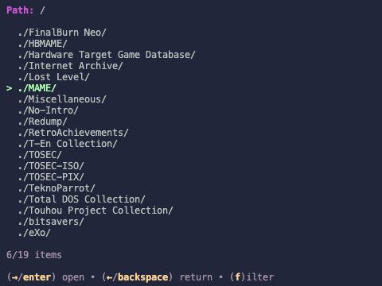
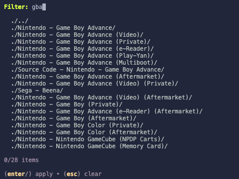

# MyrienTUI

A Terminal UI for browsing [Myrient](https://myrient.erista.me/files/)

## Screenshots

## Roadmap

### Implemented

- Live Myrient file browser with pagination and fuzzy filters

### In progress

- Declarative configuration management

### Planned

- File downloading
- Caching of path indexes
- Recursive path indexing
